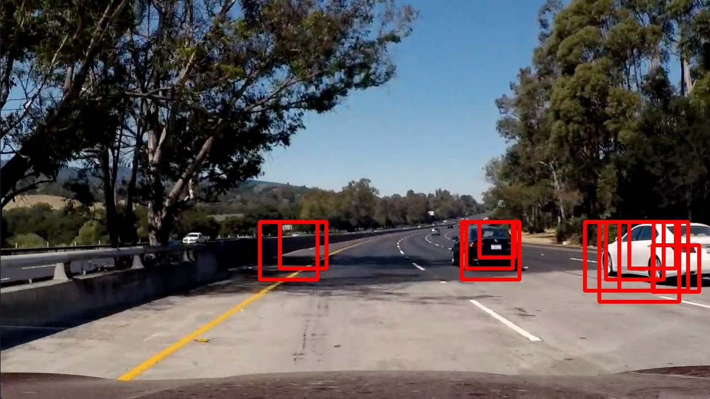
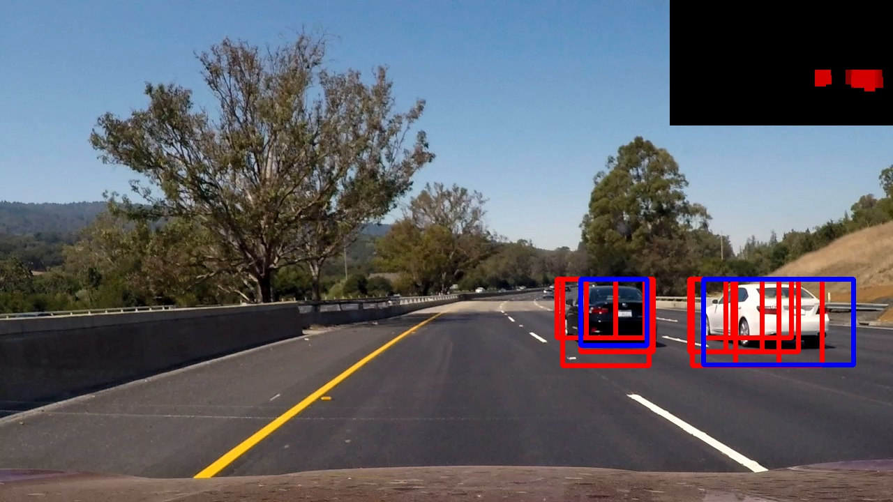
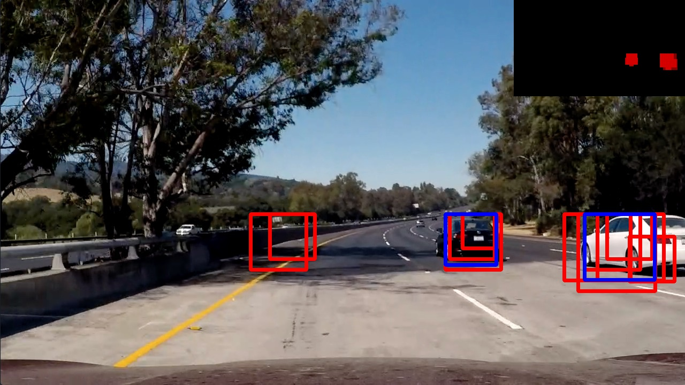

##Vehicle Detection Project

The goals / steps of this project are the following:

* Perform a Histogram of Oriented Gradients (HOG) feature extraction on a labeled training set of images and train a classifier Linear SVM classifier
* Optionally, you can also apply a color transform and append binned color features, as well as histograms of color, to your HOG feature vector. 
* Note: for those first two steps don't forget to normalize your features and randomize a selection for training and testing.
* Implement a sliding-window technique and use your trained classifier to search for vehicles in images.
* Run your pipeline on a video stream (start with the test_video.mp4 and later implement on full project_video.mp4) and create a heat map of recurring detections frame by frame to reject outliers and follow detected vehicles.
* Estimate a bounding box for vehicles detected.

---
###Project Organization
All source files below have been placed in [`vehicledetection`](vehicledetection) folder:

- [`features.py`](vehicledetection/features.py): Define methods for feature extraction. 
- [`sliding_window.py`](vehicledetection/sliding_window.py): Determine window list to search for vehicles. 
- [`search.py`](vehicledetection/search.py): Iterate through windows and apply feature extraction. 
- [`classifier.py`](vehicledetection/classifier.py): Define Classifier class responsible to train and classify vehicles. 
- [`draw.py`](vehicledetection/draw.py): Helper functions to draw on frame images.
- [`heatmap.py`](vehicledetection/heatmap.py): Define a Heatmap class that receives classifications and generate a heat map of detections. 
- [`pipeline.py`](vehicledetection/pipeline.py): Define an execution pipeline for vehicle detection.
- [`process_samples.py`](vehicledetection/process.py): Execute pipeline steps on sample images.
- [`process_video.py`](vehicledetection/process_video.py): Process video frames using the vehicle detection pipeline.

###Feature Extraction

A module responsible for feature extraction was defined in [`features.py`](vehicledetection/features.py).
The [`single_img_features`](vehicledetection/features.py#L47) function uses three strategies to extract features from input images.
This function also convert to a target color space passed as parameter. 

####1. Histograms of Color

A function [`color_hist`](vehicledetection/features.py#L35) to calculate histograms of color was defined.
It compute the histogram of the color channels separately and return a concatenated array of features.

Example of histogram applied to an input image:


####2. Spatial Binning of Color

The function [`bin_spatial`](vehicledetection/features.py#L28) just resize the input image to a fixed size (normally a smaller size) and return a vector of features. 

Example of spatial binning of color:


####3. Histogram of Oriented Gradients (HOG)

The function [`get_hog_features`](vehicledetection/features.py#L7) calculates the Histogram of Oriented Gradients (HOG) of an input image.
It uses the opencv scikit-learn `hog` function to calculate the HOG using a set of input parameters.
 
The parameters used in this project was:

```
orient = 12 # HOG  
pix_per_cell = 8  # HOG pixels per cell
cell_per_block = 2  # HOG cells per block
hog_channel = "ALL"  # All channels from an image with HLS color space
```

See below a visualization of HOG applied to an image:


###SVM Classifier

The [`Classifier`](vehicledetection/classifier.py) is the class responsible to train and predict vehicles on input images.
It uses `LinearSVC` (a linear SVM classifier) from scikit-learn to classify images.

The train process is defined in a [`train`](vehicledetection/classifier.py#L33) method that uses these feature extraction strategies defined above.
All features from an input image were concatenated in a single vector to be provided to the classifier.
All images in [`vehicles`](data/vehicles) and [`non-vehicles`](data/non-vehicles) were used in the train process.
The `StandardScaler` from scikit-learn was used to normalize the input parameters.

The input images was split so 80% was used in the train process and 20% in the test process.

Here is an example of one of each of the `vehicle` and `non-vehicle` classes:


Parameters from feature extraction (color space, HOG parameters, spatial size, number of bins for histogram) and SVM classifier were explored and the ones with the best accuracy in those experiments were kept ([`classifier.py#L15`](vehicledetection/classifier.py#L15)).

####Results
The SVM classifier achieve 100% of accuracy in the train set and 99.41% in the test set.

See below the results obtained from scikit-learn `classification_report` function in the test set:

|            | precision  |  recall | f1-score | support |
|------------|------------|---------|----------|---------|
|non vehicle |      0.99  |   0.99  |    0.99  |    1782 |
|    vehicle |      0.99  |   0.99  |    0.99  |    1770 |
|avg / total |      0.99  |   0.99  |    0.99  |    3552 |

###Sliding Window Search

The sliding window strategy used in this project is defined in [`sliding_window`](vehicledetection/sliding_window.py) module.

The [`pipeline`](vehicledetection/pipeline.py) module calls the `sliding_window` multiple times, each one with a different set of input parameters.
For the top of the image a smaller window size (64x64 pixels) was used with a slightly larger overlap (`0.6`) because vehicles tend to be small in this part of the image.
Other scales (84x84, 104x104, 124x124, 144x144) were used with an overlap of `0.5`.
All windows were combined and will be used for vehicle detection.

See below examples of sliding windows for 64x64, 84x84 and 144x144 scales:


###Vehicle Detection Pipeline

The vehicle detection pipeline is defined in the [`pipeline`](vehicledetection/pipeline.py) module.
It uses all algorithms described above to detect vehicles and display bounding boxes from these detections on the input image.
The pipeline uses [`search`](vehicledetection/search.py) module to iterate over windows and look for vehicles.

See below examples of detections:





A heat map, defined in [`heatmap`](vehicledetection/heatmap.py), was used to reduce the false positives in vehicle detection and get a more reliable results in the process.
The [`add_heat`](vehicledetection/heatmap.py#L13) method is called for each window that was classified as a vehicle to store these detections along multiple windows and frames. 
The [`detect`](vehicledetection/heatmap.py#L13) method applies a threshold of 3, returning pixels that belongs to more than three detected windows.
So, the `scipy.ndimage.measurements.label` function was used to generate the bounding boxes from the detections in this heat map.

See below an example of the heatmap applied to an input image (first image is the input image with all detected windows, second image is the heat map, third image is the thresholded heat map and the last image has the blue boxes representing detections):


See below examples of detections with the heat map in the top right corner and blue boxes representing the detections after the heat map process:






---

### Video Implementation
The pipeline process described above was applied to the input video.

Here's a [link to my video result](./project_video_processed.mp4?raw=true)

---

###Discussion

The heat map technique used uses a fixed threshold to get vehicle detections from frames.
This threshold could be dynamic to handle variations along different conditions of the input image. 
Also, it could use the classification probability to fill out the heat map and get more reliable detections.  

The sliding windows algorithm used in this project could be improved to better handle vehicles with different sizes and positions.
More scales can be used, with different positions along the vertical axis.
Also, the information about detections in previous frames can be used as an input for the sliding window algorithm to optimize the locations where to look for vehicles.

The features used to classify vehicles are not too strong against different light conditions.
A pre process step may be introduced to handle this problem (e.g. histogram equalization).